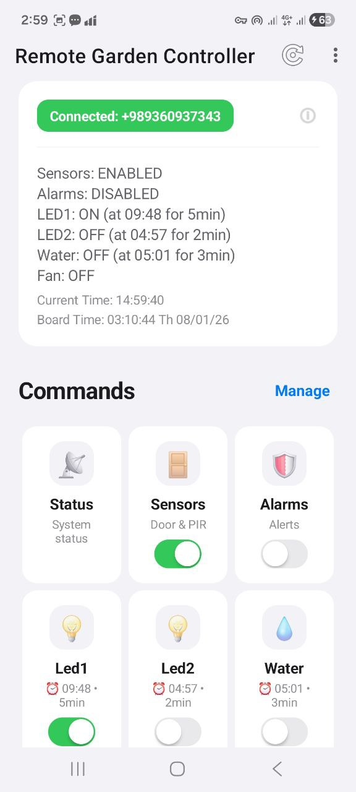
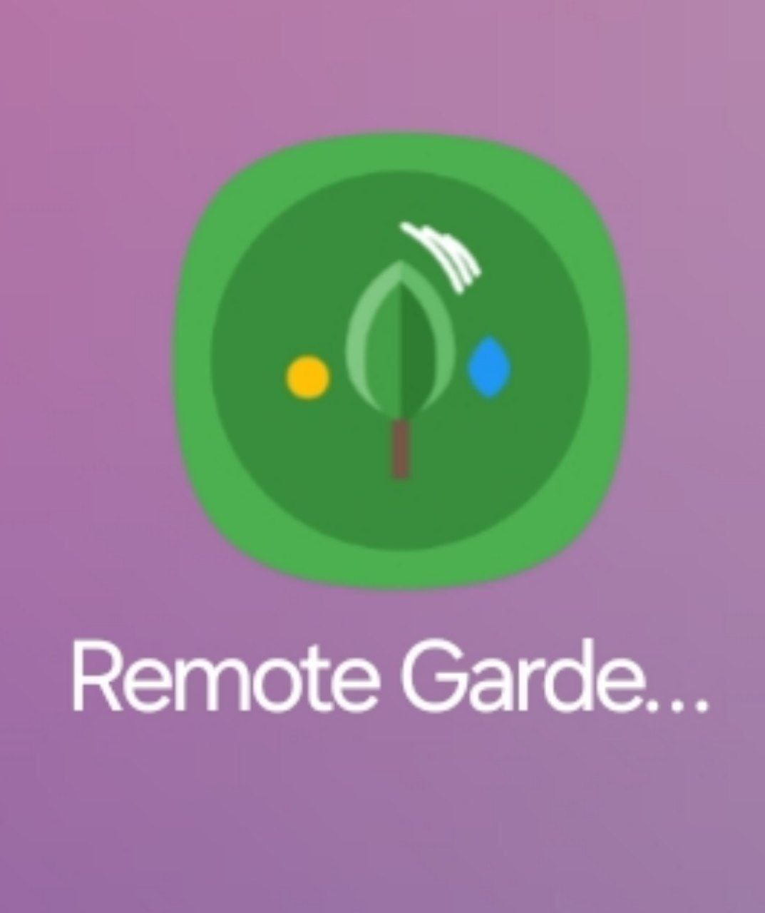
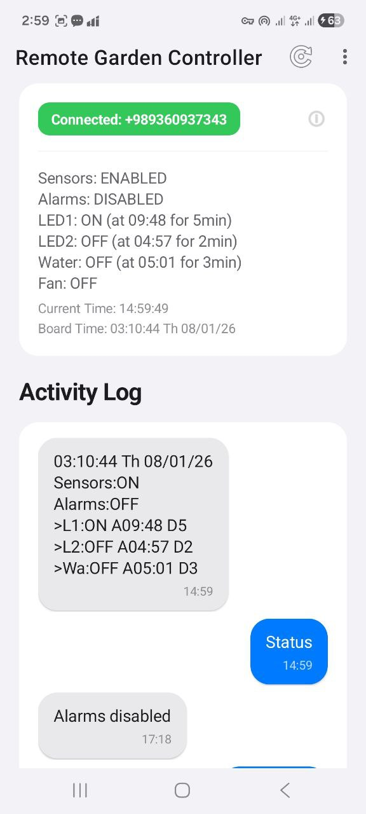
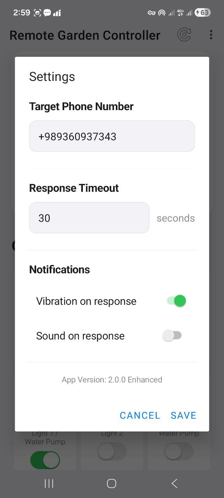
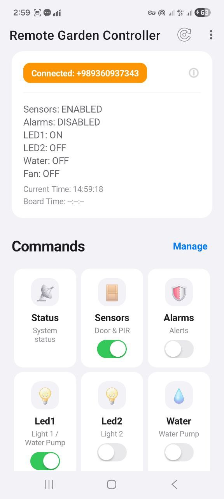

# SMS Control - Remote IoT Device Management

<div align="center">


[](https://android-arsenal.com/api?level=24)
[](LICENSE)

**Control your IoT devices remotely via SMS - No internet required**

[Features](#-features) • [Screenshots](#-screenshots) • [Installation](#-installation) • [Usage](#-usage) • [Technical Details](#-technical-details)

</div>

---

## 📱 Overview

**SMS Control** is a powerful Android application that enables remote control and monitoring of IoT devices through SMS commands. Perfect for home automation, security systems, and remote monitoring where internet connectivity is unavailable or unreliable.

### 🎯 Key Highlights

- **🌐 No Internet Required** - Works entirely over SMS
- **🔔 Real-time Alerts** - Instant notifications for sensor triggers
- **🎨 Modern UI** - iOS-inspired design with smooth animations
- **⚡ Quick Actions** - One-tap control for common tasks
- **📊 Status Monitoring** - Live device state tracking
- **🔄 Auto-refresh** - Configurable automatic status updates
- **💾 Persistent Storage** - Saves device states and chat history

---

## ✨ Features

### Device Control
- **Toggle Controls** - iOS-style switches for lights, pumps, fans
- **Sensor Management** - Enable/disable door sensors and PIR motion detectors
- **Alarm System** - Programmable timers for automated control
- **Status Monitoring** - Real-time device state display

### Smart Notifications
- **Motion Detection** - Instant alerts for PIR sensor triggers
- **Door Sensors** - Notifications when door sensors activate
- **Laser Detection** - Emergency alerts with screen wake-up
- **Custom Sounds** - Configurable vibration and sound alerts

### Advanced Features
- **Custom Commands** - Add your own commands with icons
- **Quick Commands** - Preset actions (Turn All Off/On, Restart, Emergency)
- **Auto-refresh** - Automatic status updates every 5 minutes
- **Command History** - Full SMS conversation log
- **Backup/Restore** - Save and restore configuration
- **Enable/Disable Commands** - Toggle individual commands on/off

### User Interface
- **3-Column Grid Layout** - Efficient space utilization
- **Loading States** - Visual feedback for command execution
- **Dark Mode Support** - System-wide theme support
- **Smooth Animations** - Polished click and toggle animations
- **Status Cards** - Beautiful iOS-style status displays

---

## 📸 Screenshots

<div align="center">

| Home Screen | Commands Grid | Status Monitor |
|------------|---------------|----------------|
|  |  |  |

| Alarm Setup | Message Log | Settings |
|------------|------------|----------|
|  |  |
</div>

---

## 🚀 Installation

### Prerequisites
- Android device running API 24+ (Android 7.0+)
- SMS permissions
- Target device with SMS capability

### Quick Start

1. **Clone the repository**
   ```bash
   git clone https://github.com/Awrsha/Garden-Remote-Controller.git
   cd Garden-Remote-Controller
   cd sms-control
   ```

2. **Open in Android Studio**
   ```bash
   # Open Android Studio and select "Open an Existing Project"
   # Navigate to the cloned directory
   ```

3. **Build and Run**
   ```bash
   # Connect your Android device or start an emulator
   # Click "Run" or press Shift+F10
   ```

### APK Installation

Download the latest APK from [Releases](https://github.com/Awrsha/Garden-Remote-Controller/releases) and install on your device.

---

## 📖 Usage

### Initial Setup

1. **Configure Phone Number**
   - Open the app
   - Go to Settings (menu → Settings)
   - Enter the phone number of your IoT device
   - Tap "Save"

2. **Grant Permissions**
   - Allow SMS permissions when prompted
   - Enable notification permissions for alerts
   - Grant vibration permission for haptic feedback

### Controlling Devices

#### Toggle Controls
1. Tap any toggle-enabled command (Sensors, Alarms, LEDs, Water, Fan)
2. The toggle animates to show the new state
3. SMS command is sent automatically
4. Wait for device response (loading indicator shown)

#### Setting Alarms
1. Tap an alarm command (Alarm1, Alarm2, Alarm3)
2. Set time using the time picker
3. Adjust duration with +/- buttons
4. Tap "Send" to configure the alarm

#### Status Refresh
- Tap the refresh icon in the toolbar
- Or enable auto-refresh (menu → Auto-Refresh)
- Status updates every 5 minutes when enabled

### Command Format

The app sends SMS commands in the following formats:

```
Status                    # Request full status
Sensors on               # Enable sensors
Led1 off                 # Turn off LED 1
Alarm1 14:30,10         # Set alarm at 14:30 for 10 minutes
Water on                # Turn on water pump
```

### Expected Device Responses

Your IoT device should respond with status messages like:

```
12:34:56 07/01/2026 Monday
>Sensors: ON
>Alarms: ON
>L1: ON A14:30 D10
>L2: OFF
>Water: OFF
>Fan: ON
```

---

## 🔧 Technical Details

### Architecture

```
┌─────────────────────────────────────────┐
│              MainActivity               │
│  ┌───────────────────────────────────┐  │
│  │  UI Layer (Activity + Fragments)  │  │
│  └───────────────────────────────────┘  │
│  ┌───────────────────────────────────┐  │
│  │     RecyclerView Adapters         │  │
│  │  • CommandAdapter                 │  │
│  │  • MessageAdapter                 │  │
│  └───────────────────────────────────┘  │
│  ┌───────────────────────────────────┐  │
│  │      Data Models                  │  │
│  │  • CommandItem                    │  │
│  │  • MessageItem                    │  │
│  └───────────────────────────────────┘  │
│  ┌───────────────────────────────────┐  │
│  │   Business Logic                  │  │
│  │  • SMS Management                 │  │
│  │  • State Synchronization          │  │
│  │  • Response Parsing               │  │
│  └───────────────────────────────────┘  │
└─────────────────────────────────────────┘
         │                    │
         ▼                    ▼
  ┌─────────────┐      ┌──────────────┐
  │ SMS Manager │      │ SharedPrefs  │
  └─────────────┘      └──────────────┘
```

### Key Components

#### MainActivity.java
- **Core controller** managing all app functionality
- Handles SMS sending/receiving via `BroadcastReceiver`
- Manages UI state and device synchronization
- Implements timeout handling and retry logic

#### CommandAdapter.java
- **RecyclerView adapter** for command grid
- iOS-style toggle animations
- Click and long-press handling
- Dynamic UI updates based on device state

#### Data Models
- **CommandItem** - Represents a controllable device/action
- **MessageItem** - SMS conversation history entry

### State Management

```java
// Device states stored in ConcurrentHashMap
private Map<String, Boolean> deviceStates = new ConcurrentHashMap<>();
private Map<String, String> alarmInfo = new ConcurrentHashMap<>();

// Persistent storage via SharedPreferences
- command_states: Toggle states
- chat_history: Message log
- disabled_commands: User-disabled commands
- auto_refresh: Auto-refresh setting
```

### SMS Flow

```
User Action → Send SMS → Show Loading State
                 ↓
           Device Response
                 ↓
         Parse Response → Update UI → Save State
                 ↓
          Clear Loading → Show Result
```

### Permissions Required

```xml
<uses-permission android:name="android.permission.SEND_SMS" />
<uses-permission android:name="android.permission.RECEIVE_SMS" />
<uses-permission android:name="android.permission.READ_SMS" />
<uses-permission android:name="android.permission.VIBRATE" />
<uses-permission android:name="android.permission.POST_NOTIFICATIONS" />
<uses-permission android:name="android.permission.WAKE_LOCK" />
<uses-permission android:name="android.permission.DISABLE_KEYGUARD" />
```

### Dependencies

```gradle
// AndroidX Libraries
androidx.appcompat:appcompat:1.7.0
androidx.recyclerview:recyclerview:1.3.2
androidx.cardview:cardview:1.0.0
com.google.android.material:material:1.12.0

// JSON Serialization
com.google.code.gson:gson (for state persistence)
```

### Build Configuration

```gradle
minSdk: 24 (Android 7.0)
targetSdk: 35 (Android 15)
compileSdk: 35
AGP Version: 8.12.3
```

---

## 🎨 UI/UX Features

### Design Principles
- **iOS-inspired aesthetics** - Clean, minimal, professional
- **Haptic feedback** - Vibration on interactions
- **Smooth animations** - 300ms transitions with overshoot interpolators
- **Loading states** - Visual feedback for all async operations
- **Dark mode** - Full system theme support

### Animation Details

#### Toggle Animation
```java
// Translation + Color + Scale animations
translationAnim.setDuration(300);
translationAnim.setInterpolator(new OvershootInterpolator(1.2f));
```

#### Click Feedback
```java
// Scale down → bounce back
view.animate()
    .scaleX(0.96f).scaleY(0.96f)
    .setDuration(100)
    .withEndAction(/* bounce back */);
```

---

## 🔐 Security Considerations

### SMS Validation
- Sender phone number verification
- Duplicate message prevention (2-second threshold)
- Atomic response processing with `AtomicBoolean`

### Thread Safety
- `ConcurrentHashMap` for device states
- Synchronized blocks for list modifications
- Handler-based UI updates

### Best Practices
- Always validate phone numbers before sending
- Use timeouts to prevent indefinite loading states
- Implement retry logic with exponential backoff
- Store sensitive data in encrypted SharedPreferences (recommended)

---

## 🛠️ Configuration

### Timeout Settings
```java
// Default timeout: 30 seconds
int timeout = prefs.getInt("timeout", 30) * 1000;
```

### Auto-refresh Interval
```java
// Default: 5 minutes
autoRefreshHandler.postDelayed(autoRefreshRunnable, 300000);
```

### Message History Limit
```java
// Maximum 100 messages stored
if (messageList.size() > 100) {
    messageList.remove(messageList.size() - 1);
}
```

---

## 🐛 Troubleshooting

### Common Issues

**Problem**: No response from device
- **Solution**: Check phone number configuration, verify device is powered on and has signal

**Problem**: Commands not working
- **Solution**: Ensure SMS permissions are granted, check message format compatibility

**Problem**: Duplicate messages
- **Solution**: App implements 2-second duplicate filtering automatically

**Problem**: UI not updating
- **Solution**: Ensure response parsing matches your device's message format

### Debug Mode

Enable verbose logging by checking `MainActivity` logs:
```java
// Check SMS receiver logs
@Override
public void onReceive(Context context, Intent intent) {
    // Add Log.d() statements here for debugging
}
```

---

## 🤝 Contributing

Contributions are welcome! Please follow these steps:

1. Fork the repository
2. Create your feature branch (`git checkout -b feature/AmazingFeature`)
3. Commit your changes (`git commit -m 'Add some AmazingFeature'`)
4. Push to the branch (`git push origin feature/AmazingFeature`)
5. Open a Pull Request

### Code Style
- Follow Android coding conventions
- Use meaningful variable names
- Add comments for complex logic
- Test on multiple Android versions

---

## 📋 Roadmap

- [ ] Multi-device support
- [ ] Command templates
- [ ] Scheduled commands
- [ ] Location-based automation
- [ ] Web dashboard integration
- [ ] Bluetooth fallback
- [ ] Voice commands
- [ ] Widget support

---

## 📄 License

This project is licensed under the MIT License - see the [LICENSE](LICENSE) file for details.

---

## 👨‍💻 Author

**Your Name**
- GitHub: [@awrsha](https://github.com/Awrsha)
- Email: official.parvizi@gmail.com

---

<div align="center">

**Made with ❤️ for the IoT community**

⭐ Star this repo if you find it useful!

</div>
